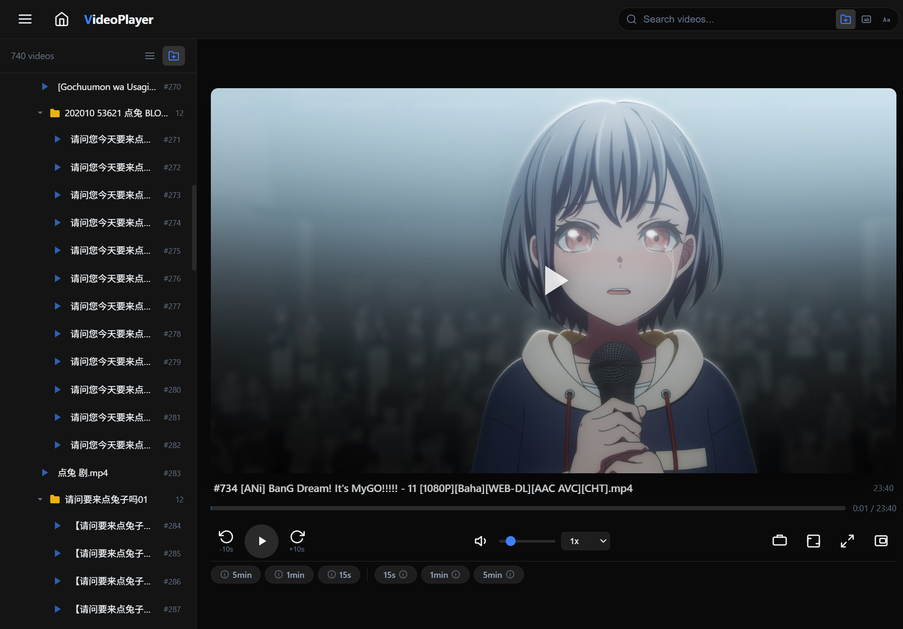

<p align="center">
  
  <h1 align="center">iAnonVideo</h1>
  <p align="center"><b>虚拟影库 · 沉浸观影 · 一机部署，全家共享</b></p>
</p>

<p align="center">
  
  
  
</p>

---

##  告别碎片化存储 —— 虚拟影库

**将散落在多个磁盘、NAS、移动硬盘中的视频碎片，挂载为统一的虚拟影库——零迁移、零整理，一个浏览器即可开启沉浸式观影。**

---

## 🎯 解决什么问题？

家庭视频存储普遍存在"碎片化"的痛点：几块硬盘各自存了一部分电影，NAS 里有一些剧集，移动硬盘上还有一批纪录片，U盘中有一些生活视频。它们散落在不同路径下，想完整浏览自己的视频收藏几乎不可能，除非手动把所有文件复制到一处——这不仅耗时，还意味着要放弃已有的目录组织。

**iAnonVideo 的答案是：不迁移，只挂载。**

---

## ✨ 核心特性

### 🗂️ 虚拟影库 —— 多盘挂载，一屏尽览

这是 iAnonVideo 最核心的能力。

你可以将任意数量、来自不同物理磁盘的目录"挂载"到 iAnonVideo 中——无论是 `D:\Movies`、`E:\TV Shows`、NAS 上的 `\\nas\media`，还是外接的 `F:\Documentaries`。挂载后，**所有目录中的视频会合并到一个统一的浏览视图里**，按文件夹层级清晰呈现，就像它们原本就存在同一个位置。

- 🔗 **只挂载，不迁移** — 视频文件原地不动，目录结构完整保留
- 🗃️ **虚拟聚合** — 多来源视频在同一界面下浏览、搜索、排序
- 📂 **文件夹树视图** — 按原始目录层级折叠展开，保留你熟悉的组织方式
- 🏷️ **文件夹标签筛选** — 一键只看某个目录的内容
- 🔍 **VSCode 风格搜索** — 支持按完整路径搜索、全字匹配、大小写敏感

> 你不需要重新整理自己的视频库。iAnonVideo 帮你把它们"看"成一个整体。

---

### 🎬 影院级沉浸式观影体验

没有任何冗余或者复杂的功能，最简洁的观影体验。点击视频，页面即刻切换为播放模式。暗色主题搭配自动隐藏的控件栏，最大限度减少视觉干扰，让你专注于画面本身。

- **影院模式** — 全屏下控件栏 3.5 秒无操作后自动淡出，鼠标轻触即现
- **宽屏模式** — 视频区域撑满浏览器宽度，适配带鱼屏 / 投影
- **画中画 (PiP)** — 小窗悬浮播放，边看边做其他事
- **自适应画质** — 利用 HTML5 `<video>` 的流式加载，按需缓冲
- **触控手势** — 移动端左右滑动快进快退，进度条可拖拽

---

### 🏠 家庭影院 —— 一机部署，全家共享

iAnonVideo 是标准的 Web 服务。把它部署在家庭服务器、NAS、或者任何一台常开的电脑上，家庭网络内的所有设备都可以通过浏览器访问：

| 设备 | 访问方式 |
|---|---|
| 📱 手机 / iPad | 浏览器打开 `http://服务器IP:4007` |
| 💻 笔记本 / 台式机 | 同上 |
| 📺 智能电视 | 电视浏览器访问同一地址 |

原生双端UI，移动端 UI 自动适配：侧边栏变为底部抽屉，上滑展开、下滑关闭，拇指友好。

**一台机器跑服务，全家人同时在线看不同的视频，互不影响。**

---

## 📸 界面预览

<p align="center">
  
  
</p>


---

### 🖥️ Windows 图形化启动器 —— 零命令行

项目提供了基于 PowerShell + WinForms 的桌面启动器：

- 🎛️ **图形界面**：可视化设置端口、添加/移除视频目录
- ▶️ **一键启停**：Start / Stop 按钮控制服务
- 📋 **实时日志**：内嵌控制台显示服务器运行输出
- 💾 **配置记忆**：端口、路径配置自动保存，下次启动无需重新设置
- 📤 **导入/导出**：配置可导出为 JSON 文件，备份或迁移

---

## 🚀 快速开始

### 环境要求

- **Node.js** 18+ LTS（[下载](https://nodejs.org/)）
- **ffmpeg**（可选，推荐）—— 用于生成视频缩略图。若未安装，视频可正常播放，只是不显示封面缩略图。

---

### Windows 用户

**方式一：使用启动器（推荐，无需敲命令）**

右键launcher.ps1，使用powershell执行

启动后你会看到一个图形化界面：
1. 设置服务**端口**（默认 4007）
2. 点击 **"+ Add Path"** 添加你的视频目录（可以有多个）
3. 点击 **"Start Server"** 启动服务
4. 若勾选了"Auto-open browser"，会自动打开浏览器；否则手动访问 `http://localhost:4007`

```powershell
# 如果需要安全权限，在项目目录下执行：
powershell -ExecutionPolicy Bypass -File launcher.ps1
```
> ℹ️ `-ExecutionPolicy Bypass` 是 PowerShell 的安全策略参数，用于允许运行本地脚本。仅影响本次执行，不会更改系统设置。详见下方 FAQ。

**方式二：命令行**

```bash
npm install
npm start
```

浏览器打开 `http://localhost:4007`。

通过环境变量添加外部视频目录：
```powershell
$env:PORT=8080
$env:VIDEO_PATHS="D:\Movies;E:\TV"
npm start
```

---

### Linux / macOS 用户

```bash
# 1. 安装依赖
npm install

# 2. 启动服务器（默认端口 4007）
npm start

# 3. 通过环境变量挂载外部视频目录
VIDEO_PATHS="/mnt/videos:/mnt/movies" PORT=8080 npm start
```

浏览器打开 `http://localhost:4007`（或你指定的端口）。

> **提示**：多个视频目录用 `;`（分号）或 `:`（冒号，Linux/macOS）分隔。服务会递归扫描每个目录，将它们聚合到同一个浏览视图中。

---

## ⚙️ 环境变量参考

| 变量 | 默认值 | 说明 |
|---|---|---|
| `PORT` | `4007` | 服务端口 |
| `VIDEO_PATHS` | (空) | 外部视频目录，多个用 `;` 分隔 |
| `FFMPEG_PATH` | `ffmpeg` | ffmpeg 可执行文件路径 |
| `THUMB_DIR` | `./thumbnails` | 缩略图缓存目录 |

---

## 📁 项目结构

```
iAnonVideo/
├── server.js          # Express 后端：视频扫描 / API / 静态服务 / 缩略图生成
├── package.json        # 项目配置与依赖
├── launcher.ps1        # Windows 图形化启动器
├── public/
│   ├── index.html      # 前端主页面
│   ├── scripts.js      # 前端逻辑 (~1400 行 IIFE)
│   └── styles.css      # 暗色主题样式 (~1650 行 CSS 变量)
├── thumbnails/         # 缩略图缓存 (自动生成)
└── node_modules/       # 依赖
```

---

## 🛠️ 技术栈

| 层 | 技术 |
|---|---|
| 运行时 | Node.js |
| 后端 | Express 4.x |
| 前端 | 原生 HTML5 / CSS3 / JS (ES6+)，零框架 |
| 视频播放 | HTML5 `<video>` |
| 图标 | 内联 SVG |
| 缩略图 | ffmpeg |
| Windows 启动器 | PowerShell 5.1 + WinForms |

---

## 🔮 后续计划

- [ ] 外挂字幕支持（`.srt` / `.vtt`）
- [ ] 播放列表（顺序 / 随机 / 循环）
- [ ] 断点续播
- [ ] PWA 离线支持
- [ ] 可选密码保护
- [ ] 拖拽视频文件至页面播放
- [ ] 进度条缩略图悬停预览

---

## ❓ 常见问题

**Q: `powershell -ExecutionPolicy Bypass -File launcher.ps1` 这个命令安全吗？**

`-ExecutionPolicy Bypass` 用于临时绕过 PowerShell 的执行策略以运行 `.ps1` 脚本。因为 Windows 默认禁止运行未签名的脚本，这个参数是必需的。它只在本次执行中生效，不会修改系统设置。如果你有顾虑，可以右键 `launcher.ps1` → "使用 PowerShell 运行"。

**Q: 没有缩略图显示？**

安装 ffmpeg 并确保它在 PATH 中（`ffmpeg -version` 验证），或设置 `FFMPEG_PATH` 环境变量指向 ffmpeg 可执行文件。不安装 ffmpeg 不影响视频播放。

**Q: 如何让同一网络下的其他设备访问？**

启动后服务监听 `0.0.0.0`，局域网内任意设备通过 `http://<服务器IP>:4007` 即可访问。建议在路由器上给服务器设置固定 IP。

**Q: 能否部署到公网？**

可以，但不建议直接暴露。如需远程访问，建议使用 VPN、Tailscale 等安全隧道方案。

**Q: 视频格式不支持？**

取决于你的浏览器。`mp4 (H.264)` 兼容性最好。`mkv` 在多数现代浏览器中也可播放。iOS/Safari 对部分格式有限制。


---

## 🙏 致谢

本项目由 Coding Agent（[opencode](https://github.com/anomalyco/opencode) + DeepSeek-V4-Pro）辅助开发。

---

## 📄 License

[MIT](LICENSE)
